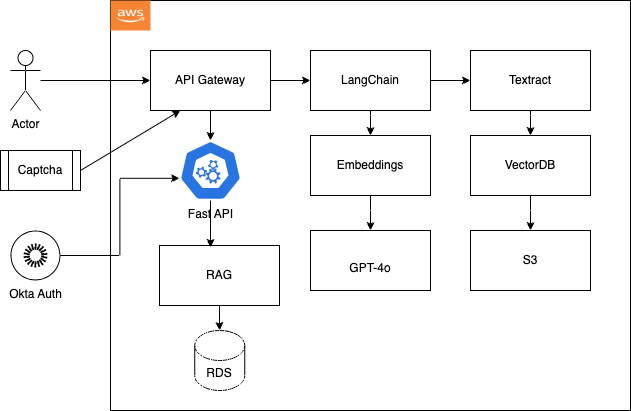
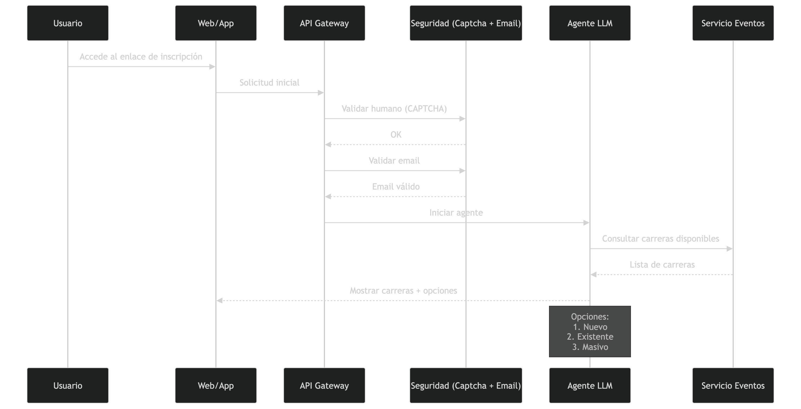
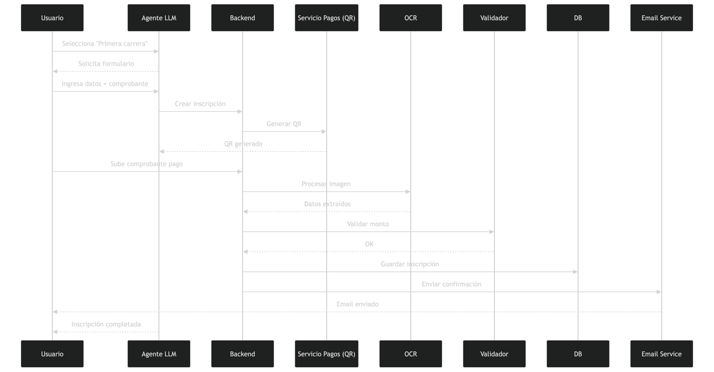
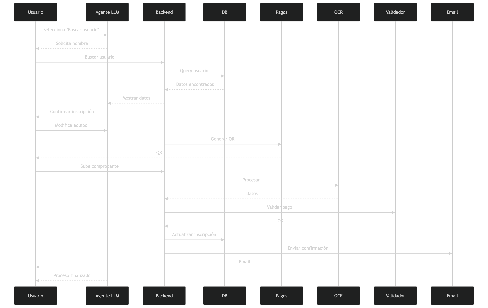
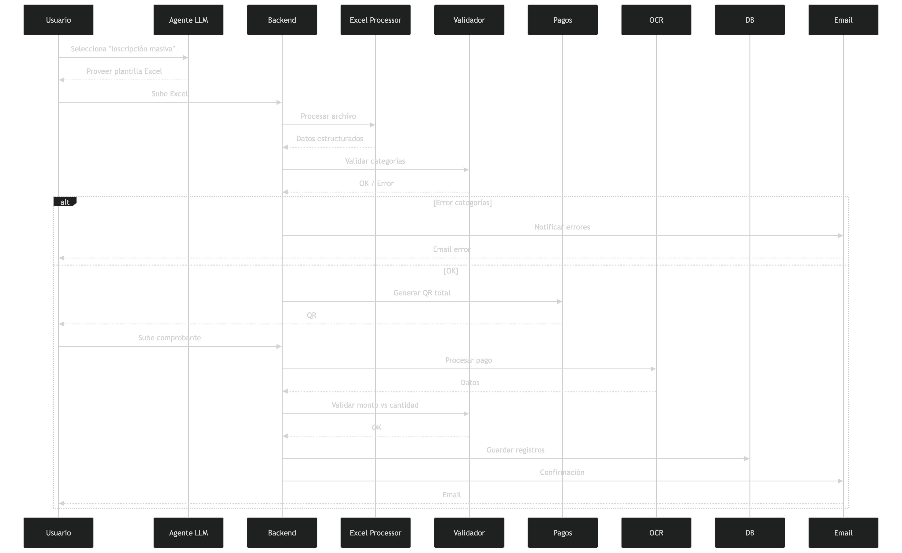
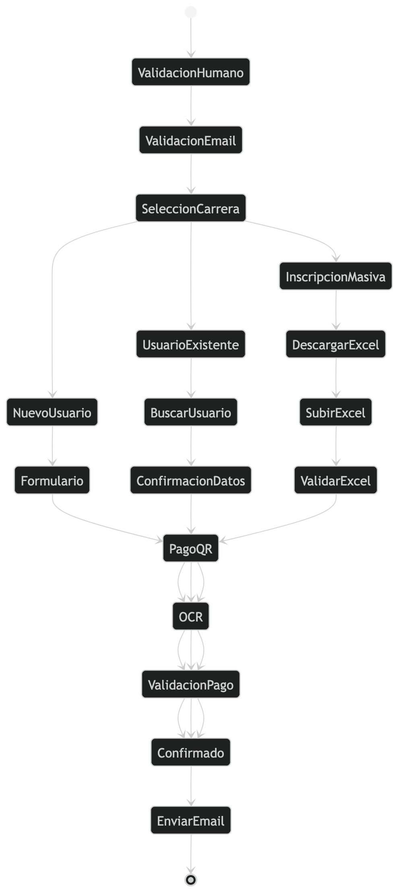
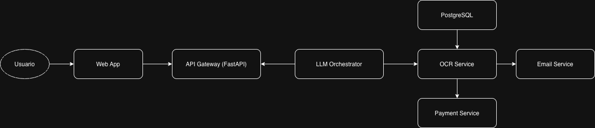

# 🤖 Plantilla Oficial de Documentación — Proyecto Final AI/LLM

**Programa:** AI-LLM Solution Architect  
**Curso:** 5 — Proyecto Final de Arquitectura e Integración AI/LLM  
**Documento:** Plantilla Oficial de Documentación del Proyecto

---

## 📋 Información General del Proyecto

| Campo | Valor |
|-------|-------|
| **Nombre del Proyecto** | *CicloAI* |
| **Participante(s)** | *Jose Miguel Lanza Caceres* |
| **Instructor** | *Andres Rojas* |
| **Cohorte / Edición** | *2025-2026* |
| **Fecha de Inicio** | *20/03/2026* |
| **Fecha de Entrega Final** | *DD/MM/AAAA* |
| **Versión del Documento** | *v0.1.03202026* |
| **Estado del Proyecto** | * **En Planificación** / En Desarrollo / Completado* |
| **Repositorio GitHub/GitLab** | *https://github.com/cheyolanza/cicloai* |
| **Entorno Cloud** | * AWS  |
| **Stack Tecnológico Principal** | Python, Docker, FastAPI |

---

## Tabla de Contenidos

- [1. Resumen Ejecutivo](#1-resumen-ejecutivo)
- [2. Análisis y Especificación de Requerimientos](#2-análisis-y-especificación-de-requerimientos)
- [3. Diseño de Arquitectura AI/LLM](#3-diseño-de-arquitectura-aillm)
- [4. Diseño de APIs y Conectores](#4-diseño-de-apis-y-conectores)
- [5. Seguridad, Cumplimiento y Ética](#5-seguridad-cumplimiento-y-ética)
- [6. Implementación y Configuración de Infraestructura](#6-implementación-y-configuración-de-infraestructura)
- [7. Estrategia de Pruebas y Resultados](#7-estrategia-de-pruebas-y-resultados)
- [8. Despliegue, Escalabilidad y Costos](#8-despliegue-escalabilidad-y-costos)
- [9. Observabilidad y Monitoreo](#9-observabilidad-y-monitoreo)
- [10. Resultados, Conclusiones y Trabajo Futuro](#10-resultados-conclusiones-y-trabajo-futuro)
- [11. Rúbrica de Evaluación](#11-rúbrica-de-evaluación)
- [12. Referencias y Bibliografía](#12-referencias-y-bibliografía)
- [Anexos](#anexos)

---

## 1. Resumen Ejecutivo

CicloAI es una solución basada en inteligencia artificial diseñada para automatizar el proceso de inscripción de ciclistas en competencias en Santa Cruz de la Sierra, Bolivia. Actualmente, los procesos de inscripción son manuales, propensos a errores, lentos y difíciles de auditar, especialmente cuando se manejan grandes volúmenes de participantes mediante formularios o archivos Excel. Esta situación genera inconsistencias en los datos, validaciones incorrectas y una carga operativa significativa para los organizadores.

La propuesta introduce un agente conversacional basado en modelos de lenguaje (LLM) que guía al usuario de forma estructurada desde el inicio del proceso de inscripción. El flujo inicia con una validación obligatoria de humanidad (anti-bots) y verificación de correo electrónico, asegurando que las interacciones provienen de usuarios reales. Posteriormente, el agente consulta y presenta las competencias disponibles, ofreciendo tres caminos principales: inscripción por primera vez, búsqueda de usuario existente o inscripción masiva mediante archivo Excel.

El sistema permite la recolección de datos personales, validación en tiempo real, procesamiento de archivos Excel, y análisis de comprobantes de pago mediante OCR. Además, integra un mecanismo de validación de pagos contra montos esperados y número de participantes, así como el envío automático de correos de verificación al finalizar cada flujo.

Desde el punto de vista arquitectónico, el sistema se implementa mediante una API REST desacoplada, un motor de orquestación basado en LLM que actúa como agente central del flujo, procesamiento de documentos y almacenamiento en la nube, asegurando escalabilidad, seguridad y alta disponibilidad. Asimismo, incorpora un pipeline RAG para contextualizar respuestas con reglas de negocio, categorías de competencia y validaciones específicas del dominio.

Los resultados esperados incluyen una reducción de más del 70% en tiempos operativos, una disminución superior al 80% en errores de registro, una mejora significativa en la validación de pagos y una mayor trazabilidad del proceso. El sistema está diseñado para operar en español y preparado para futuras extensiones.

---

### 1.1 Propuesta de Valor y Problema que Resuelve

El problema principal radica en la gestión manual de inscripciones a competencias deportivas, lo cual genera errores en datos, inconsistencias en equipos, validaciones incorrectas de pagos y una alta carga operativa para los organizadores. En eventos con más de 100 participantes, estos problemas pueden traducirse en retrasos, conflictos y pérdida de confianza por parte de los competidores.

Adicionalmente, los procesos actuales carecen de mecanismos robustos de validación de usuarios (anti-bots), verificación de identidad básica (correo electrónico) y control automatizado de pagos en función del número de inscritos, lo que incrementa el riesgo de fraude o inconsistencias financieras.

CicloAI propone una solución basada en inteligencia artificial que automatiza completamente este proceso mediante un agente conversacional que orquesta el flujo de inscripción. El sistema valida desde el inicio que el usuario sea humano y cuente con un correo válido, luego guía al usuario a través de diferentes caminos según su necesidad: registro nuevo, reutilización de datos existentes o inscripción masiva.

Mediante este enfoque, el sistema recolecta información, valida reglas de negocio, controla la coherencia de datos (como equipos y categorías), y procesa documentos automáticamente. La incorporación de OCR permite validar comprobantes de pago sin intervención manual inicial, mientras que el sistema también valida que el monto pagado corresponda correctamente al número de participantes registrados.

El uso de RAG garantiza respuestas contextualizadas y precisas basadas en reglas del dominio, competencias habilitadas y criterios de validación.

Esta solución es óptima frente a enfoques tradicionales porque combina automatización, validación inteligente, control de fraude y escalabilidad. Permite reducir costos operativos, mejorar la precisión de los datos, asegurar la integridad del proceso y ofrecer una experiencia de usuario moderna y guiada.

---

### 1.2 Alcance y Delimitación

| ✅ EN SCOPE | ❌ OUT OF SCOPE |
|------------|----------------|
| Validación de usuario humano (anti-bots) y verificación de email al inicio del flujo | Entrenamiento de modelos desde cero (fine-tuning) |
| Interfaz conversacional con LLM para guiar el flujo completo de inscripción | Integración con sistemas bancarios externos |
| Inscripción individual (nuevo usuario) con validación de datos y pago | Soporte multi-idioma (solo español) |
| Búsqueda de usuarios previamente registrados y reutilización de datos | Aplicaciones móviles nativas |
| Inscripción masiva mediante carga de archivos Excel | Integración con sistemas externos |
| Validación de comprobantes de pago mediante OCR | |
| Validación automática de montos de pago según número de inscritos | |
| Envío de correos de verificación al finalizar el proceso | |
| Despliegue en entorno cloud (AWS/GCP) | |
| Dashboard administrativo para aprobación/rechazo (HITL) | |

### 1.3 Indicadores Clave de Éxito (KPIs del Proyecto)

| KPI / Métrica | Línea Base | Meta Objetivo | Resultado Obtenido |
|---------------|-----------|---------------|-------------------|
| Latencia promedio (p95) | N/A | < 2 segundos | *[Completar al final]* |
| Tasa de éxito de respuestas | N/A | > 92% | *[Completar al final]* |
| Costo por 1,000 consultas (USD) | N/A | < 1 USD | *[Completar al final]* |
| Cobertura de pruebas (%) | 0% | > 80% | *[Completar al final]* |
| Precisión OCR | N/A | > 85% | *[Completar al final]* |

---
## 2. Análisis y Especificación de Requerimientos

### 2.1 Contexto del Caso de Uso Empresarial

El sistema CicloAI se enmarca en el sector de eventos deportivos, específicamente en la gestión de inscripciones para competencias de ciclismo en Santa Cruz de la Sierra, Bolivia. Actualmente, el proceso de inscripción (AS-IS) es manual, basado en formularios, correos electrónicos y archivos Excel, lo que genera errores en los datos, duplicidad de registros, inconsistencias en equipos y validaciones manuales de pagos. Este proceso es lento, poco escalable y depende fuertemente de la intervención humana.

Los actores involucrados son: ciclistas (usuarios finales), organizadores del evento y administradores del sistema. Los usuarios utilizan el sistema principalmente durante periodos de inscripción, con una frecuencia intensiva en ventanas cortas de tiempo (picos de uso). Se estima un volumen de entre 100 y 500 inscripciones por evento.

El flujo propuesto (TO-BE) automatiza el proceso mediante un agente conversacional basado en LLM que actúa como orquestador central del sistema. El flujo inicia con una validación obligatoria de humanidad (anti-bots) y verificación de correo electrónico, garantizando que solo usuarios reales puedan iniciar el proceso.

Posteriormente, el agente consulta las competencias habilitadas y guía al usuario a través de tres caminos principales:
1. Inscripción por primera vez
2. Búsqueda de usuario existente
3. Inscripción masiva mediante archivo Excel

El sistema realiza validaciones en múltiples capas:
- Validación inicial (humano + email)
- Validaciones de datos en tiempo real
- Validaciones de reglas de negocio (categorías, equipos)
- Validación de pagos (monto vs número de inscritos)

El procesamiento de comprobantes de pago se realiza mediante OCR, y el sistema verifica automáticamente la consistencia del monto pagado. Además, se envían correos de verificación como cierre del flujo, garantizando trazabilidad.

El administrador interviene únicamente en casos excepcionales o procesos de revisión, reduciendo significativamente la carga operativa.

---

### 2.2 Requerimientos Funcionales

| ID | Descripción del Requerimiento | Prioridad | Criterio de Aceptación |
|----|-------------------------------|-----------|------------------------|
| RF-001 | El sistema debe recibir consultas en lenguaje natural y retornar respuestas coherentes con el contexto empresarial. | Alta | Respuesta generada en < 3s con coherencia > 90% |
| RF-002 | El sistema debe integrar fuentes de datos estructuradas y no estructuradas como contexto (RAG). | Alta | Recuperación correcta en > 85% de consultas de prueba |
| RF-003 | El sistema debe permitir la inscripción individual guiada paso a paso mediante el agente LLM. | Alta | Flujo completo sin errores en > 95% de pruebas |
| RF-004 | El sistema debe permitir la carga y validación de archivos Excel con múltiples participantes. | Alta | Procesamiento exitoso de archivos con ≥100 registros en < 5s |
| RF-005 | El sistema debe validar que todos los participantes del Excel pertenezcan al mismo equipo. | Alta | Rechazo automático si existe inconsistencia |
| RF-006 | El sistema debe clasificar automáticamente a los participantes según categoría (edad y tipo). | Alta | Clasificación correcta en > 90% de casos |
| RF-007 | El sistema debe procesar comprobantes de pago mediante OCR. | Alta | Extracción correcta de datos en > 85% de casos |
| RF-008 | El sistema debe enviar notificaciones por correo al administrador para aprobación. | Media | Email enviado en < 10 segundos |
| RF-009 | El sistema debe proveer un dashboard para aprobación/rechazo de inscripciones. | Alta | Visualización y acción en tiempo real |
| RF-010 | El sistema debe validar que el usuario es humano antes de iniciar el flujo (CAPTCHA o mecanismo equivalente). | Alta | Validación exitosa en > 95% de intentos |
| RF-011 | El sistema debe requerir y validar un correo electrónico antes de iniciar el proceso de inscripción. | Alta | Email válido verificado antes de continuar |
| RF-012 | El sistema debe permitir la selección guiada de competencias disponibles. | Alta | Listado correcto de eventos habilitados |
| RF-013 | El sistema debe permitir la búsqueda de usuarios previamente registrados por nombre. | Alta | Recuperación correcta en > 90% |
| RF-014 | El sistema debe permitir reutilizar datos de usuarios existentes con edición limitada (equipo). | Alta | Edición restringida correctamente aplicada |
| RF-015 | El sistema debe validar que el monto del pago corresponda al número de participantes inscritos. | Alta | Validación correcta en > 95% |
| RF-016 | El sistema debe generar y mostrar un medio de pago (QR) al usuario. | Alta | QR generado correctamente en < 2s |
| RF-017 | El sistema debe enviar un correo de confirmación al finalizar el flujo de inscripción. | Alta | Email enviado correctamente en < 10s |
| RF-018 | El sistema debe validar que los participantes del Excel pertenezcan a categorías válidas. | Alta | Rechazo automático si hay inconsistencias |

---

### 2.3 Requerimientos No Funcionales

| ID | Categoría | Descripción | Métrica / Umbral |
|----|-----------|-------------|-----------------|
| RNF-001 | Rendimiento | Latencia de respuesta extremo a extremo | p95 < 2s bajo carga normal |
| RNF-002 | Escalabilidad | Capacidad de manejar picos de tráfico durante inscripciones | Auto-scaling hasta 1000 usuarios concurrentes |
| RNF-003 | Seguridad | Autenticación y autorización de usuarios | OAuth 2.0 / JWT, cifrado HTTPS |
| RNF-004 | Disponibilidad | Uptime del servicio | >= 99.5% mensual (SLA) |
| RNF-005 | Cumplimiento | Protección de datos personales | Cumplimiento de buenas prácticas (PII masking) |
| RNF-006 | Observabilidad | Monitoreo y trazabilidad del sistema | Logs estructurados + dashboards en tiempo real |
| RNF-007 | Usabilidad | Interfaz intuitiva y flujo conversacional claro | ≥ 90% satisfacción en pruebas de usuario |
| RNF-008 | Precisión AI | Calidad de respuestas del LLM | > 92% de respuestas correctas |
| RNF-009 | Procesamiento OCR | Exactitud en extracción de datos de pago | ≥ 85% precisión |
| RNF-010 | Mantenibilidad | Facilidad de evolución del sistema | Arquitectura modular desacoplada |
| RNF-011 | Portabilidad | Despliegue en entornos cloud | Compatible con AWS/GCP |
| RNF-012 | Tiempo de procesamiento batch | Procesamiento de archivos Excel | ≤ 5 segundos para 100 registros |
| RNF-013 | Seguridad | Prevención de bots mediante validación de humanidad (CAPTCHA o equivalente) | > 95% efectividad |
| RNF-014 | Integridad de pagos | Validación automática de consistencia entre monto pagado y número de inscritos | > 95% precisión |
| RNF-015 | Confiabilidad del flujo | Garantizar finalización completa del flujo con confirmación por email | > 98% éxito |

---

### 2.4 Restricciones y Supuestos

| Restricciones | Supuestos |
|--------------|-----------|
| Presupuesto cloud máximo: USD $50/mes (revisar) | Los usuarios tienen acceso a internet estable |
| No integración con sistemas bancarios en esta versión (solo validación por comprobante) | El modelo LLM está disponible vía API |
| Sistema operará únicamente en idioma español | Los usuarios proporcionan datos correctos |
| No se permite almacenamiento de datos sensibles en logs | Existencia de datos de prueba para validación |
| Dependencia de servicios externos (LLM, OCR, CAPTCHA) | Disponibilidad continua de servicios cloud |
| Validación de pagos basada en OCR, no en confirmación bancaria directa | Los comprobantes de pago son legibles y contienen información relevante |

## 3. Diseño de Arquitectura AI/LLM

### 3.1 Diagrama de Arquitectura General (Nivel C4 — Contexto y Contenedor)

> 📌 **Descripción:** El siguiente diagrama representa la arquitectura de alto nivel del sistema CicloAI bajo el modelo C4 (Contexto y Contenedores). Se incluyen los actores principales, la capa de API, el orquestador LLM, servicios de validación (CAPTCHA, reglas de negocio), procesamiento OCR, almacenamiento de datos y componentes cloud.



**Figura 1. Diagrama de Arquitectura General — CicloAI v0.2**

---

### 3.2 Descripción de Componentes Arquitectónicos

| Componente | Tecnología / Servicio | Responsabilidad Principal | Justificación de Selección |
|------------|----------------------|--------------------------|---------------------------|
| API Gateway | FastAPI + Nginx | Exposición de endpoints, routing, rate limiting |Ligero, rápido, ideal para microservicios
| Orquestador LLM | LangChain | Manejo de prompts, RAG, chains | Ecosistema maduro, integración nativa con LLMs |
| Modelo LLM Base | GPT-4o  | Procesamiento de lenguaje, interpretación de formularios | Alta precisión, multimodal (clave para OCR + texto) |
| Vector Store |  ChromaDB  | Búsqueda semántica para RAG | Open source, fácil integración local |
| Capa de Datos | PostgreSQL | Persistencia de metadata | Escalable  estándar en backend
| Observabilidad | Prometheus + Grafana | Monitore y metricas | Open source y robusto |
| Seguridad / IAM | Okta | Autenticación y autorización | Integración enterprise |
| OCR Service | Tesseract / AWS Textract | Extraccion de text de documentos| Necesario para inscripciones, verificacion de pagos por comprobantes

### 3.3 Diagrama de Flujo de Datos e Integración

#### 3.3.1 Flujo General + Decisión Inicial

*Figura 2. Flujo de Datos General + Decisión Inicial — CicloAI*


#### 3.3.2 Flujo Nuevo Usuario (Primer Carrera)

*Figura 3. Flujo Nuevo Usuario (Primer Carrera) — CicloAI*

#### 3.3.3 Flujo Usuario Existente

*Figura 4. Flujo Usuario Existente  — CicloAI*

#### 3.3.4 Flujo Inscripción Masiva

*Figura 5. Flujo Usuario Existente  — CicloAI*

#### 3.3.5 Flujo State Machine

*Figura 6. Flujo State Machine  — CicloAI*

#### 3.3.5 Arquitectura

*Figura 7. Arquitectura — CicloAI*


### 3.4 Estrategia de Diseño de Prompts y RAG

**System Prompt Base:**

*Documente el system prompt que guía el comportamiento del modelo. Incluya: rol, restricciones, formato de respuesta esperado, y manejo de casos fuera de alcance.*

```
Eres un asistente experto en gestión de inscripciones a competencias de ciclismo.

Tu función es analizar requisitos, validar documentos y asistir en el proceso de registro.

RESTRICCIONES:
- Solo responde en base al contexto proporcionado.
- Si no tienes información suficiente, responde: "No tengo información sobre eso."
- No inventes datos.
- No generes contenido fuera del dominio de ciclismo o inscripciones.

FORMATO DE RESPUESTA:
{
  "status": "ok | error",
  "analysis": "...",
  "required_documents": [],
  "recommendations": []
} 
```

## 3.4 Arquitectura física (equivalencias por nube)

| Capa | AWS | GCP | Azure |
|---|---|---|---|
| Ingesta | Lambda / API Gateway | Cloud Functions / Cloud Run | Azure Functions |
| Raw (Bronze) | S3 (raw docs) | GCS | ADLS Gen2 |
| Transform | Glue / Lambda | Dataflow | Synapse / Databricks |
| Curated (Silver) | S3 (cleaned JSON / text) | GCS | ADLS |
| Serving (Gold) | RDS / Aurora + pgvector | BigQuery | Synapse SQL |
| Vector Layer | OpenSearch / pgvector / Pinecone | Vertex AI Vector Search | Azure AI Search |
| Orquestación | Step Functions | Workflows | ADF |
| Observabilidad | CloudWatch + X-Ray | Cloud Monitoring | Azure Monitor |

---

## Estrategia de Recuperación (RAG)

### Tipo de chunking
Hybrid chunking (semántico + tamaño fijo)

**Justificación:**
Permite preservar contexto semántico en documentos no estructurados (formularios, reglas de competencia) mientras mantiene control sobre el tamaño de entrada al modelo.

---

### Tamaño de chunks
500 tokens

**Justificación:**
Balance adecuado entre contexto suficiente y precisión en la recuperación.

---

### Overlap
100 tokens

**Justificación:**
Evita pérdida de contexto entre segmentos consecutivos.

---

### Modelo de embeddings
text-embedding-3-small (OpenAI)

**Alternativa:**
all-MiniLM-L6-v2 (open source)

**Justificación:**
Buen balance entre costo, rendimiento y facilidad de integración.

---

### Función de similitud
Cosine similarity

**Justificación:**
Estándar en NLP, eficiente y compatible con embeddings normalizados.

---

### Top-K
5

**Justificación:**
Reduce ruido manteniendo suficiente contexto relevante.

---

### Threshold
0.75

**Justificación:**
Filtra resultados de baja relevancia, mejorando la precisión del sistema.

---

### Re-ranking
Sí — Cross-encoder re-ranking

**Implementación:**
- Modelo sugerido: bge-reranker-base
- Flujo:
  1. Recuperación inicial top-10
  2. Re-ranking
  3. Selección final top-3

**Beneficios:**
- Mejora precisión
- Reduce alucinaciones
- Mejora relevancia del contexto enviado al LLM

---

### Pipeline RAG completo

1. Usuario envía query
2. Se genera embedding del query
3. Se consulta vector store
4. Se recuperan documentos (top-k)
5. Se aplica re-ranking
6. Se construye prompt:
   - system prompt
   - contexto relevante
   - query del usuario
7. Se envía al LLM
8. Se genera respuesta final

---

### Resumen ejecutivo

Se implementa un enfoque RAG híbrido con chunking semántico y tamaño fijo (500 tokens, overlap 100). Se utiliza el modelo de embeddings text-embedding-3-small con similitud coseno. Se recuperan los top-5 documentos relevantes con un threshold de 0.75.

Se incorpora una capa de re-ranking mediante cross-encoder, donde inicialmente se recuperan 10 documentos y se seleccionan los 3 más relevantes antes de enviar el contexto al LLM.

Este enfoque mejora la precisión, reduce alucinaciones y permite actualización dinámica de la base de conocimiento sin necesidad de fine-tuning.---


## 4. Diseño de APIs y Conectores

### 4.1 Especificación de Endpoints (API REST)

*Los endpoints siguen convenciones REST: recursos claros, versionado `/v1`, y uso de métodos HTTP para acciones.*

| Endpoint | Método | Descripción | Request Body / Params | Response Schema |
|----------|--------|-------------|----------------------|-----------------|
| `/api/v1/health` | GET | Health check del sistema | N/A | `{"status": "healthy\|degraded", "components": object}` |

### 🔐 Seguridad y Validación Inicial

| Endpoint | Método | Descripción | Request | Response |
|----------|--------|-------------|--------|----------|
| `/api/v1/security/captcha/verify` | POST | Validar que el usuario es humano | `{ "captcha_token": string }` | `{ "valid": boolean }` |
| `/api/v1/security/email/verify` | POST | Validar formato y existencia de email | `{ "email": string }` | `{ "valid": boolean }` |

---

### 👤 Autenticación

| Endpoint | Método | Descripción | Request Body / Params | Response Schema |
|----------|--------|-------------|----------------------|-----------------|
| `/api/v1/auth/login` | POST | Autenticación del usuario (via SSO / credenciales) | `{"email": string, "password": string}` | `{"access_token": string, "expires_in": int}` |

---

### 🏁 Gestión de Carreras

| Endpoint | Método | Descripción | Request | Response |
|----------|--------|-------------|--------|----------|
| `/api/v1/events` | GET | Obtener carreras habilitadas | N/A | `[{ "event_id": string, "name": string }]` |

---

### 🤖 Agente / Orquestación

| Endpoint | Método | Descripción | Request | Response |
|----------|--------|-------------|--------|----------|
| `/api/v1/agent/start` | POST | Inicia flujo conversacional validado | `{ "email": string }` | `{ "session_id": string }` |
| `/api/v1/agent/next-step` | POST | Avanza en el flujo según decisión del usuario | `{ "session_id": string, "input": object }` | `{ "next_action": string, "data": object }` |

---

### 👤 Usuarios

| Endpoint | Método | Descripción | Request | Response |
|----------|--------|-------------|--------|----------|
| `/api/v1/users/search` | GET | Buscar usuario por nombre | `query: name` | `{ "found": boolean, "user": object }` |

---

### 📝 Inscripciones

| Endpoint | Método | Descripción | Request Body / Params | Response Schema |
|----------|--------|-------------|----------------------|-----------------|
| `/api/v1/inscriptions` | POST | Crear solicitud de inscripción | `{"user_data": object, "event_id": string}` | `{"inscription_id": string, "status": "pending"}` |
| `/api/v1/inscriptions/{id}` | GET | Obtener estado de inscripción | `path: id` | `{"status": string, "details": object}` |

---

### 📄 Documentos

| Endpoint | Método | Descripción | Request | Response |
|----------|--------|-------------|--------|----------|
| `/api/v1/documents/excel` | POST | Cargar archivo Excel | `multipart/form-data (file)` | `{"status": "uploaded", "rows_processed": int}` |
| `/api/v1/documents/payment-image` | POST | Cargar comprobante de pago | `multipart/form-data (image)` | `{"status": "uploaded", "file_id": string}` |

---

### 💰 Pagos

| Endpoint | Método | Descripción | Request | Response |
|----------|--------|-------------|--------|----------|
| `/api/v1/payments/qr` | GET | Generar QR de pago | `amount` | `{ "qr_code": base64 }` |
| `/api/v1/payments/analyze` | POST | Analizar comprobante con OCR | `{ "file_id": string }` | `{ "status": "validated\|rejected", "amount": float }` |
| `/api/v1/payments/validate` | POST | Validar monto vs inscritos | `{ "amount": float, "participants": int }` | `{ "valid": boolean }` |

---

### 🧠 Procesamiento IA

| Endpoint | Método | Descripción | Request | Response |
|----------|--------|-------------|--------|----------|
| `/api/v1/inscriptions/{id}/process` | POST | Ejecutar validaciones + IA (RAG + LLM) | `{ "inscription_id": string }` | `{ "status": "approved\|review\|rejected" }` |

---

### 🧑‍⚖️ HITL (Human-in-the-Loop)

| Endpoint | Método | Descripción | Request | Response |
|----------|--------|-------------|--------|----------|
| `/api/v1/admin/review-queue` | GET | Casos pendientes | N/A | `[object]` |
| `/api/v1/admin/inscriptions/{id}/approve` | POST | Aprobación manual | `{ "admin_id": string }` | `{ "status": "approved" }` |
| `/api/v1/admin/inscriptions/{id}/reject` | POST | Rechazo manual | `{ "admin_id": string, "reason": string }` | `{ "status": "rejected" }` |

---

### 📧 Notificaciones

| Endpoint | Método | Descripción | Request | Response |
|----------|--------|-------------|--------|----------|
| `/api/v1/notifications/email` | POST | Enviar correo de confirmación | `{ "email": string }` | `{ "status": "sent" }` |

---

## 4.2 Autenticación y Autorización

| Campo | Descripción |
|-------|-------------|
| **Mecanismo Auth** | JWT Bearer Token con OAuth 2.0 |
| **Proveedor de Identidad** | Okta |
| **Gestión de Secrets** | AWS Secrets Manager |
| **Rate Limiting** | 100 req/min por usuario, 1000 req/min global |
| **Roles definidos** | `user`, `admin`, `system` |

---

## 4.3 Modelo de Roles (RBAC)

| Rol | Permisos |
|-----|---------|
| **user** | Iniciar flujo, inscribirse, subir documentos, consultar estado |
| **admin** | Aprobar/rechazar inscripciones, revisar pagos |
| **system** | Orquestación IA, OCR, validaciones, notificaciones |

---

## 4.4 Flujo principal del sistema (end-to-end)

1. Usuario accede al sistema  
2. Validación CAPTCHA (`/security/captcha/verify`)  
3. Validación email (`/security/email/verify`)  
4. Inicio de flujo (`/agent/start`)  
5. Consulta de carreras (`/events`)  
6. Usuario selecciona tipo de inscripción  
7. Flujo guiado por agente (`/agent/next-step`)  
8. Creación inscripción (`/inscriptions`)  
9. Upload documentos (`/documents/...`)  
10. Generación QR (`/payments/qr`)  
11. OCR (`/payments/analyze`)  
12. Validación monto (`/payments/validate`)  
13. Procesamiento IA (`/inscriptions/{id}/process`)  
14. Decisión:
   - Aprobado automático  
   - Escalado a HITL  
15. Revisión admin (`/admin/...`)  
16. Notificación (`/notifications/email`)  

---

## 4.5 Flujo principal del sistema (end-to-end)

### Flujo Masivo (Excel)

1. CAPTCHA  
2. Validación email  
3. Selección opción masiva  
4. Upload Excel  
5. Validación datos y categorías  
6. Generación QR  
7. OCR pago  
8. Validación monto total  
9. IA  
10. HITL si aplica  
11. Notificación  

---

## 4.6 Flujo principal del sistema (end-to-end)

### Flujo Individual

1. CAPTCHA  
2. Validación email  
3. Selección opción individual  
4. Formulario datos  
5. Generación QR  
6. OCR pago  
7. Validación monto  
8. IA  
9. HITL si aplica  
10. Notificación  

---

## 4.7 Consideraciones de diseño

- Versionado: `/api/v1/`
- Arquitectura orientada a eventos (preparada para async)
- Orquestación central mediante agente LLM
- Validaciones desacopladas (seguridad, negocio, pagos)
- Formato estándar: JSON

### Manejo de errores

```json
{
  "error": {
    "code": "INVALID_REQUEST",
    "message": "Descripción del error"
  }
}
```

---

## 5. Seguridad, Cumplimiento y Ética

### 5.1 Modelo de Amenazas y Controles de Seguridad

| Amenaza / Riesgo | Vector de Ataque | Nivel | Control Implementado | Justificación Técnica |
|-----------------|-----------------|-------|---------------------|----------------------|
| Prompt Injection | Input malicioso del usuario | **ALTO** | Input sanitization + guardrails LLM | Validación de input, detección de patrones de inyección con regex + LLM classifier |
| Data Leakage | Respuestas con PII no autorizado | **ALTO** | Output filtering + PII redaction | Integración con AWS Comprehend PII detection o equivalente |
| API Key Exposure | Repositorio público / logs | **CRÍTICO** | Secrets Manager + SAST CI/CD | Pre-commit hooks, rotación automática de keys |
| DoS / Abuso de API | Volumen excesivo de requests | **MEDIO** | Rate limiting + WAF | API Gateway throttling + AWS WAF / CloudFlare |
| *[Amenaza]* | | | | |

### 5.2 Cumplimiento Regulatorio

| Regulación | Requerimiento Aplicable | Control Implementado | Evidencia |
|-----------|------------------------|---------------------|-----------|
| GDPR (si aplica) | Derecho al olvido, consentimiento explícito, notificación de breaches | *[Medidas implementadas]* | *[Link a política / log]* |
| ISO 27001 / SOC 2 | Gestión de accesos, auditoría, continuidad del negocio | *[Controles]* | *[Evidencia]* |
| Política Interna de IA | Uso responsable de IA, revisión humana de decisiones críticas | *[Definir]* | *[Evidencia]* |
| *[Otra regulación]* | | | |

### 5.3 Marco Ético de la Solución AI

| Dimensión Ética | Riesgo Identificado | Mecanismo de Mitigación |
|----------------|--------------------|-----------------------|
| Sesgos algorítmicos | El modelo puede perpetuar sesgos del corpus de entrenamiento | Evaluación periódica de outputs + dataset de benchmarking de equidad |
| Transparencia | Los usuarios pueden no saber que interactúan con IA | Disclosure explícito en interfaz + mecanismo de escalamiento a humano |
| Alucinaciones | El modelo puede generar información falsa con confianza alta | RAG + citación de fuentes + umbral de confianza mínimo configurable |
| Privacidad de datos | Inputs del usuario podrían usarse para reentrenamiento | Opt-out explícito, cero retention policy en APIs de terceros |
| *[Dimensión adicional]* | | |

---

## 6. Implementación y Configuración de Infraestructura

### 6.1 Stack Tecnológico y Justificación

| Capa | Tecnología Seleccionada | Alternativas Evaluadas | Razón de Selección / Estado |
|------|------------------------|------------------------|-----------------------------|
| Frontend | React + TypeScript + Material UI | Next.js, Vue | Implementado. Permite construir la interfaz conversacional, formularios reutilizables y consumo de APIs REST. |
| Backend API | FastAPI + Python | Flask, Django | Implementado. Framework liviano, compatible con tipado, Pydantic y servicios AI/LLM. |
| LLM Provider | OpenAI | Gemini, Anthropic | Propuesto / Pendiente. Configurado para agente conversacional y RAG mediante variables de entorno. |
| Modelo LLM | gpt-4o-mini | GPT-4o, Gemini 1.5 | Propuesto / configurable por variable de entorno. Usado como modelo objetivo para el agente y clasificación con RAG. |
| Embeddings | text-embedding-3-small | all-MiniLM-L6-v2 | Propuesto / Pendiente. Definido para RAG por relación costo/rendimiento. |
| RAG | Documentos locales desde `assets/documents/category_rules/` | Búsqueda directa en base de datos, prompts estáticos | Implementado parcialmente. Diseñado para responder sobre convocatoria y reglas usando `convocatoria.txt`. |
| Vector DB | ChromaDB local | FAISS, Pinecone | Propuesto / Pendiente. Diseñado para persistencia local inicial del vector store. |
| OCR | Google Vision API | AWS Textract, Tesseract | En integración. OCR para comprobantes de pago usando cuenta de servicio y `GOOGLE_APPLICATION_CREDENTIALS`. |
| Base de Datos | PostgreSQL | MySQL, SQLite | Implementado. Persistencia relacional para carreras, ciclistas, equipos y pagos. |
| Migraciones | Alembic | Flyway, Liquibase | Implementado. Versionado de cambios de esquema de base de datos. |
| Seguridad | Google reCAPTCHA + Bearer Token | Auth0, Okta | Implementado parcialmente. CAPTCHA inicial y Bearer Token propio para endpoints protegidos. |
| Containerización | Docker + docker-compose | Kubernetes, ECS | Implementado localmente. Kubernetes pendiente de implementación. |
| CI/CD | GitHub Actions | GitHub Actions | Implementado para backend y despliegue Cloud Run mediante workflows separados. |
| Observabilidad | Logging básico | CloudWatch, Grafana, Prometheus | Pendiente de implementación avanzada. |
| Cloud Provider | Google Cloud | AWS, Azure | Parcial. Google Cloud se usa para OCR y el despliegue definido usa Artifact Registry, Cloud Run y Cloud SQL. |
| IaC | Pendiente | Terraform, CDK | Pendiente de implementación. |

### 6.2 Estructura del Repositorio

La estructura actual del proyecto está separada en frontend, backend y orquestación local con Docker Compose. Algunas capacidades cloud permanecen pendientes de implementación.

```bash
cicloai/
├── cicloai-backend/
│   ├── src/
│   │   └── cicloai/
│   │       ├── application/
│   │       ├── domain/
│   │       ├── infrastructure/
│   │       ├── interfaces/
│   │       │   └── api/
│   │       └── rag/
│   ├── assets/
│   │   ├── documents/
│   │   │   └── category_rules/
│   │   │       └── convocatoria.txt
│   │   └── payments/
│   ├── alembic/
│   │   └── versions/
│   ├── tests/
│   ├── scripts/
│   ├── data/
│   ├── storage/
│   ├── requirements.txt
│   ├── Dockerfile
│   ├── alembic.ini
│   ├── .env.example
│   └── README.md
├── cicloai-frontend/
│   ├── src/
│   │   ├── app/
│   │   ├── components/
│   │   │   ├── common/
│   │   │   └── layout/
│   │   ├── config/
│   │   ├── features/
│   │   │   ├── access/
│   │   │   ├── agent/
│   │   │   ├── biker-search/
│   │   │   ├── payment/
│   │   │   ├── race/
│   │   │   ├── registration/
│   │   │   └── teams/
│   │   ├── services/
│   │   ├── styles/
│   │   ├── theme/
│   │   ├── types/
│   │   └── utils/
│   ├── public/
│   │   └── images/
│   ├── package.json
│   ├── Dockerfile
│   └── README.md
├── secrets/
│   └── google-service-account.json
├── docker-compose.yml
├── .env.example
└── README.md
```

Notas de estado:

- `secrets/google-service-account.json` representa la ruta esperada para credenciales locales de Google Cloud. El archivo real no debe versionarse.
- `assets/payments/` almacena comprobantes subidos de forma local durante el flujo de validación OCR.
- `assets/documents/category_rules/convocatoria.txt` es la fuente documental usada para reglas de convocatoria y detección de categorías.
- Kubernetes, Terraform y observabilidad avanzada están pendientes de implementación.
- El despliegue a Cloud Run está definido en GitHub Actions. La provisión de secretos en Google Secret Manager debe realizarse fuera del repositorio.

### 6.3 Variables de Entorno Relevantes

Las variables se gestionan mediante archivos `.env` y `.env.example`. Las credenciales reales no deben subirse al repositorio.

| Variable | Uso | Estado |
|---------|-----|--------|
| `DATABASE_URL` | Override explícito de conexión SQLAlchemy. Si existe, tiene prioridad sobre `DB_*` y Cloud SQL | Implementado |
| `DB_HOST` | Host PostgreSQL para ejecución local o Docker Compose | Implementado |
| `DB_PORT` | Puerto PostgreSQL para ejecución local o Docker Compose | Implementado |
| `DB_NAME` | Nombre de la base de datos PostgreSQL | Implementado |
| `DB_USER` | Usuario PostgreSQL | Implementado |
| `DB_PASSWORD` | Password PostgreSQL. En Cloud Run debe provenir de Secret Manager | Implementado |
| `CLOUD_SQL_INSTANCE_CONNECTION_NAME` | Nombre de conexión Cloud SQL, por ejemplo `ciclo-ai:us-central1:cicloai-postgres` | Implementado para Cloud Run |
| `JWT_SECRET_KEY` | Firma de Bearer Tokens propios del backend | Implementado |
| `JWT_ALGORITHM` | Algoritmo JWT | Implementado |
| `JWT_EXPIRE_SECONDS` | Tiempo de expiración del token | Implementado |
| `GOOGLE_RECAPTCHA_SECRET_KEY` | Validación backend de reCAPTCHA | Implementado parcialmente |
| `ENABLE_CAPTCHA_MOCK` | Activación de mock CAPTCHA en local | Implementado |
| `GOOGLE_APPLICATION_CREDENTIALS` | Ruta al JSON de cuenta de servicio para Google Vision API | En integración |
| `GOOGLE_CLOUD_PROJECT_ID` | Proyecto Google Cloud asociado al OCR | En integración |
| `GOOGLE_VISION_OCR_ENDPOINT` | Endpoint de Google Vision OCR | En integración |
| `OPENAI_API_KEY` | API key para OpenAI | Propuesto / Pendiente |
| `OPENAI_MODEL` | Modelo conversacional, por defecto `gpt-4o-mini` | Propuesto / configurable |
| `OPENAI_EMBEDDING_MODEL` | Modelo de embeddings, por defecto `text-embedding-3-small` | Propuesto / configurable |
| `RAG_TOP_K` | Cantidad de chunks recuperados por RAG | Propuesto / configurable |
| `RAG_SIMILARITY_THRESHOLD` | Umbral de similitud para recuperación | Propuesto / configurable |
| `CATEGORY_RULES_PDF_PATH` | Ruta al archivo de reglas, actualmente `convocatoria.txt` | Implementado |
| `RUN_DB_MIGRATIONS` | Ejecuta `alembic upgrade head` al iniciar el contenedor backend | Implementado |
| `RUN_DB_SEED` | Ejecuta el seed idempotente al iniciar el contenedor backend | Implementado |

Prioridad de configuración de base de datos:

1. Si `DATABASE_URL` tiene valor, el backend usa esa URL directamente.
2. Si `DATABASE_URL` está vacío y existe `CLOUD_SQL_INSTANCE_CONNECTION_NAME`, el backend construye una URL compatible con Cloud SQL:

```text
postgresql+psycopg2://DB_USER:DB_PASSWORD@/DB_NAME?host=/cloudsql/CLOUD_SQL_INSTANCE_CONNECTION_NAME
```

3. Si no existe `CLOUD_SQL_INSTANCE_CONNECTION_NAME`, el backend construye la conexión local usando `DB_HOST`, `DB_PORT`, `DB_NAME`, `DB_USER` y `DB_PASSWORD`.

### 6.4 Ejecución Local con Docker Compose

La ejecución local definida usa Docker Compose para levantar frontend, backend y PostgreSQL.

```bash
docker compose up --build
```

Servicios locales:

| Servicio | URL / Puerto | Estado |
|---------|--------------|--------|
| Frontend | `http://localhost:5173` | Implementado |
| Backend API | `http://localhost:8000` | Implementado |
| PostgreSQL | `localhost:5432` | Implementado |

Comandos operativos:

```bash
docker compose logs -f backend
docker compose exec backend alembic upgrade head
docker compose exec backend python -m cicloai.infrastructure.database.seed
docker compose exec backend python -m cicloai.rag.index_documents
```

El contenedor backend ejecuta automáticamente antes de levantar FastAPI:

```bash
alembic upgrade head
python -m cicloai.infrastructure.database.seed
```

Estas acciones se controlan con:

```env
RUN_DB_MIGRATIONS=true
RUN_DB_SEED=true
```

### 6.5 Pruebas y Cobertura

El backend cuenta con pruebas unitarias iniciales usando `pytest`. La cobertura mínima requerida por CI es 75%.

```bash
cd cicloai-backend
pytest
PYTHONPATH=src COVERAGE_RCFILE=.coveragerc pytest --cov=cicloai --cov-report=term-missing --cov-fail-under=75
```

Estado:

- Tests unitarios iniciales: Implementado.
- `pytest-cov`: Implementado.
- Objetivo de cobertura 75%: Implementado como quality gate del workflow backend.

### 6.6 Despliegue en Google Cloud Run y Cloud SQL

El despliegue a Google Cloud Run está definido en:

```text
.github/workflows/deploy.yml
```

El workflow construye y publica imágenes Docker en Artifact Registry, y despliega frontend y backend en servicios separados de Cloud Run.

Para Cloud SQL se usa el nombre de conexión:

```text
ciclo-ai:us-central1:cicloai-postgres
```

El backend recibe estas variables durante el despliegue:

```env
DB_NAME=cicloai-db
DB_USER=cicloai_user
CLOUD_SQL_INSTANCE_CONNECTION_NAME=ciclo-ai:us-central1:cicloai-postgres
RUN_DB_MIGRATIONS=true
RUN_DB_SEED=true
```

Durante cada despliegue, el contenedor backend corre migraciones Alembic y seed idempotente antes de iniciar Uvicorn. Si una migración falla, el contenedor no inicia la API, evitando servir endpoints contra una base incompleta.

La contraseña no se define en el código ni en el workflow. Debe existir como secreto en Google Secret Manager:

```text
db-password
```

El workflow monta la instancia Cloud SQL con:

```bash
--add-cloudsql-instances="ciclo-ai:us-central1:cicloai-postgres"
```

También inyecta secretos sensibles desde Secret Manager:

```text
DB_PASSWORD=db-password:latest
JWT_SECRET_KEY=jwt-secret-key:latest
OPENAI_API_KEY=openai-api-key:latest
GOOGLE_RECAPTCHA_SECRET_KEY=google-recaptcha-secret-key:latest
/app/secrets/google-service-account.json=google-service-account-json:latest
```

Permisos requeridos para la service account usada por Cloud Run:

- `Cloud SQL Client`
- `Secret Manager Secret Accessor`
- Permisos mínimos para leer imágenes desde Artifact Registry

Si la base de datos creada en Cloud SQL tiene otro nombre, actualizar `CLOUD_SQL_DATABASE` en `.github/workflows/deploy.yml`.

### 6.7 Pendientes de Infraestructura

| Área | Estado |
|------|--------|
| Kubernetes | Pendiente de implementación |
| Terraform / IaC | Pendiente de implementación |
| Provisión automatizada de infraestructura cloud | Pendiente de implementación |
| Creación automatizada de secretos | Pendiente de implementación |
| Observabilidad avanzada | Pendiente de implementación |
| Validación productiva del despliegue Cloud Run | Pendiente de implementación |

---

## CI/CD

El backend cuenta con un workflow de GitHub Actions para validar instalación de dependencias, lint o chequeo sintáctico, tests y cobertura mínima.

Workflow:

```text
.github/workflows/backend-ci.yml
```

El pipeline usa Python 3.11 y desactiva dependencias externas reales mediante variables de entorno seguras para CI:

```env
ENVIRONMENT=test
ENABLE_CAPTCHA_MOCK=true
RECAPTCHA_ENABLE_MOCKS=true
ENABLE_OCR_MOCK=true
ENABLE_RAG_MOCK=true
JWT_SECRET_KEY=test-secret
JWT_ALGORITHM=HS256
JWT_EXPIRE_SECONDS=3600
DATABASE_URL=sqlite:///./test.db
OPENAI_API_KEY=test-key
CATEGORY_RULES_PDF_PATH=app/assets/documents/category_rules/convocatoria.txt
```

Comando principal del pipeline:

```bash
pytest --cov=app --cov-report=term-missing --cov-fail-under=75
```

Cobertura mínima requerida:

```text
75%
```

Comando local equivalente para backend:

```bash
cd cicloai-backend
PYTHONPATH=src COVERAGE_RCFILE=.coveragerc pytest --cov=cicloai --cov-report=term-missing --cov-fail-under=75
```

Para ejecutar solo los tests sin cobertura:

```bash
cd cicloai-backend
pytest
```

Notas:

- El CI no llama OpenAI real.
- El CI no llama Google Vision OCR real.
- El CI no llama Google reCAPTCHA real.
- El CI no requiere archivos JSON de credenciales.
- El workflow crea placeholders seguros para documentos y pagos cuando son necesarios.
